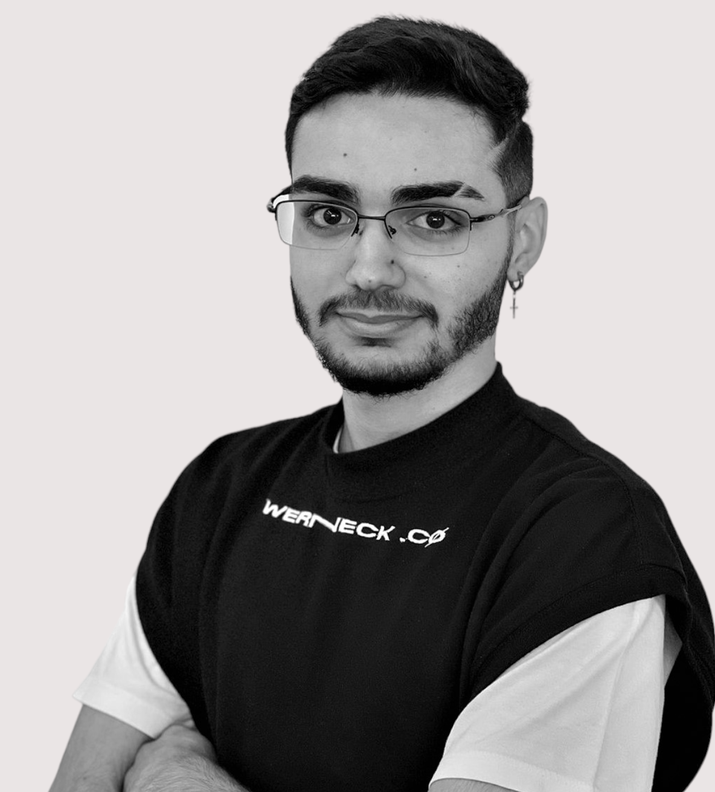

<h1 align="center">Bem-vindo(a) ao meu perfil! 😎</h1>

Me chamo Marco e tenho 20 anos. Sou um Desenvolvedor Front-End e Projetista Mecânico, estudante de Engenharia da Computação no Centro Universitário UNA - Campus Betim. Atualmente trabalho na PTC Group como Projetista, participando da gestão do produto (Underbody).  
Gosto de criar, recriar e melhorar projetos que encontro pela internet e estou sempre participando de eventos que possam me ajudar a melhorar minhas habilidades na programação. Dê uma olhada em meus repositórios, se gostar de algo deixe uma estrela para me ajudar! 😁

 

<h1 align="center">Estatísticas do GitHub</h1>

 

  
 

 

  
 

 

 <h1>Linguagens e Tecnologias</h1>
 
 
 
 
 
 

 

 
 
 
 
 
 

 

 
 
 
 

 
 

 <h1>Contato</h1>
 
 

